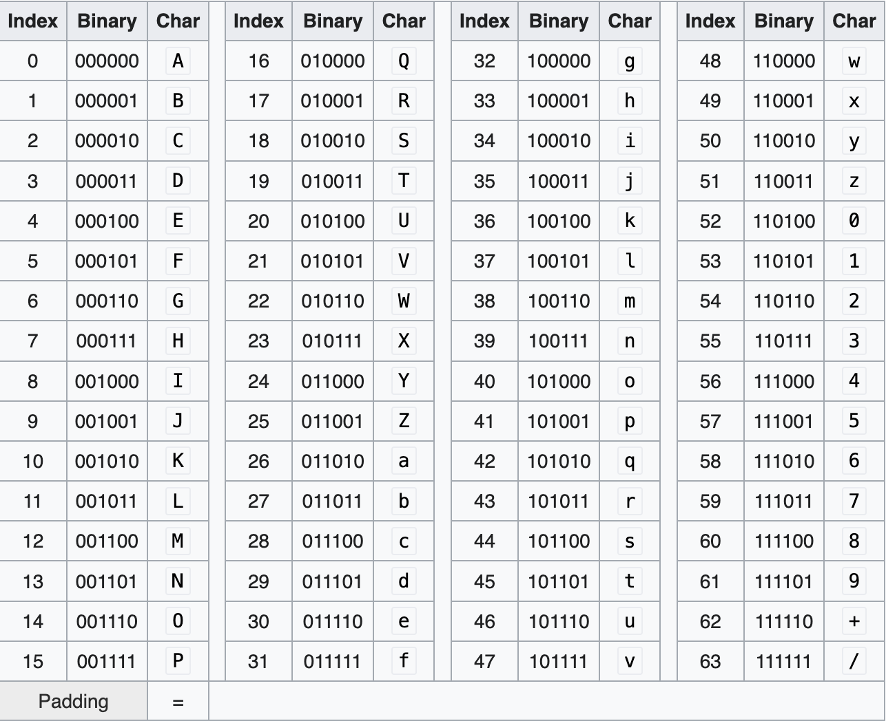

# Base64

## Design

Base64 is a group of binary-to-text encoding schemes that transforms binary data into a sequence of printable characters, limited to a set of 64 unique characters. More specifically, the source binary data is taken 6 bits at a time, then this group of 6 bits is mapped to one of 64 unique characters.

## Characters

Base64 encoding uses the following 64 characters: A-Z, a-z, 0-9, +, /

## Usage

Base64 is designed to carry data stored in binary formats across channels that only reliably support text content. Base64 is particularly prevalent on the World Wide Web where one of its uses is the ability to embed image files or other binary assets inside textual assets such as HTML and CSS files.

Base64 is also widely used for sending e-mail attachments, because SMTP – in its original form – was designed to transport 7-bit ASCII characters only

## Links

[Wikipedia](https://en.wikipedia.org/wiki/Base64)
